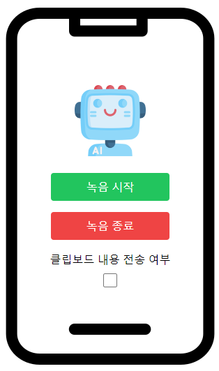

## MAL-BUD-FRONTEND

```bash
cd mal-bud-frontend
npm install
npm start
```

and connect to localhost:3000



---
## MAL-BUD-BACKEND

```bash
cd mal-bud-backend
python -m venv .venv
source .venv/bin/activate # .venv\Scripts\activate in windows
pip install -r requirements.txt
python manage.py runserver
```

then the backend server will be running on localhost:8000

---
## Structure

* ### SST: whisper-large-v3
* ### VLM: llama-3.2-11b-vision-preview (to be replaced by finetuned LLaVA-OneVision later)
  (LLM: llama-3.1-8b-instant)
* ### TTS: SK open API A.X TTS (to be replaced by finetuned TTS model later)

---